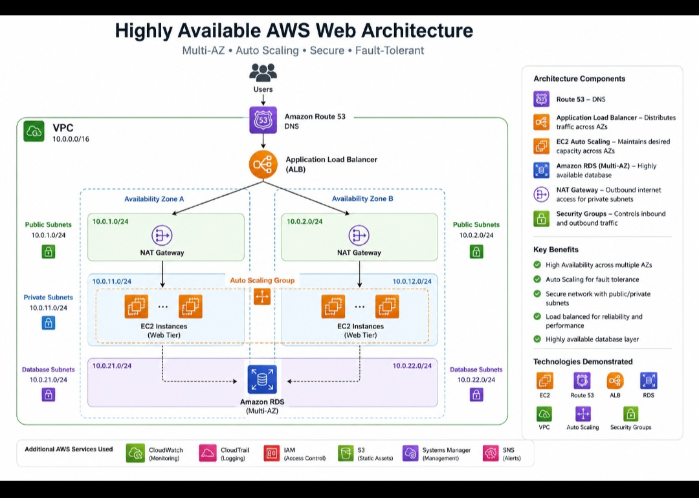

# Highly Available AWS Web Architecture

## Project Summary

Designed a highly available AWS web architecture intended to remain available if a single compute instance or Availability Zone experiences a failure.
## Architecture Diagram



## Architecture

Internet users connect through an Application Load Balancer. Traffic is distributed across EC2 instances deployed in multiple Availability Zones. Auto Scaling maintains capacity and replaces unhealthy instances. Security groups restrict access by role.

## AWS Services

- Amazon VPC
- Amazon EC2
- Application Load Balancer (ALB)
- Auto Scaling
- Security Groups
- Amazon CloudWatch
- Amazon SNS

## Architecture Flow

Internet → Application Load Balancer → EC2 Auto Scaling Group → Multiple Availability Zones

## Key Features

- High availability across multiple Availability Zones
- Automatic replacement of unhealthy EC2 instances
- Load balancing across multiple servers
- Auto Scaling based on application demand
- Security groups to control network access
- CloudWatch monitoring and alerting

## Skills Demonstrated

- AWS networking
- EC2 administration
- Load balancing
- Auto Scaling
- High-availability architecture
- Cloud monitoring
- AWS security best practices

## What I Learned

This project strengthened my understanding of designing resilient AWS environments. I learned how Application Load Balancers, Auto Scaling, EC2, multiple Availability Zones, security groups, and monitoring services can work together to improve application availability and reliability.
## Infrastructure Implementation

This project includes AWS CloudFormation templates that demonstrate the infrastructure behind the highly available web architecture.

### Core Infrastructure

The `template.yaml` template defines:

- Amazon VPC
- Two Availability Zones
- Public subnets
- Internet Gateway
- Application Load Balancer
- EC2 Launch Template
- Auto Scaling Group
- Security Groups
- Apache web server installation

### Monitoring & Auto Scaling

The `scaling-policy.yaml` template demonstrates:

- Target-tracking Auto Scaling
- Average CPU utilization target of 60%
- CloudWatch CPU monitoring
- High CPU alarm at 80%
- Amazon SNS notification integration

## Architecture Flow

```text
Internet
   ↓
Application Load Balancer
   ↓
Auto Scaling Group
   ↓
EC2 Instances
 ↙          ↘
AZ 1        AZ 2
```

## Project Files

- `template.yaml` — Core AWS infrastructure
- `scaling-policy.yaml` — Auto Scaling and CloudWatch configuration
- `diagram.jpg` — Architecture diagram
- `README.md` — Project documentation

## Deployment Status

The CloudFormation templates provide a portfolio implementation of this architecture. The AWS resources should be deployed and tested before this project is described as a completed production deployment.
