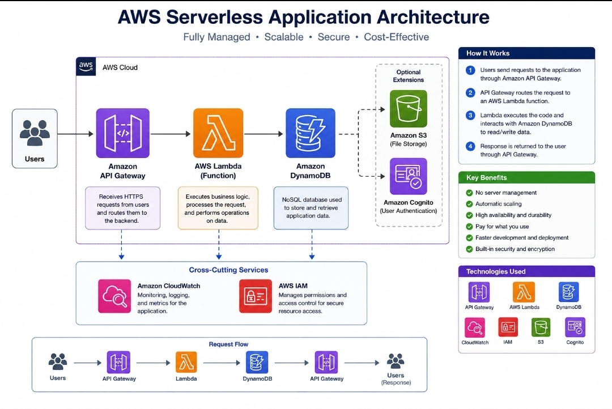

# AWS Serverless Application

## Project Summary

Designed a serverless application architecture on AWS using managed services. The project demonstrates how an application can process requests and store data without managing traditional servers.
## Architecture Diagram



## Architecture

Users send requests through Amazon API Gateway. API Gateway invokes an AWS Lambda function that processes the request. The application stores and retrieves data from Amazon DynamoDB.

This serverless design can automatically scale based on demand while reducing the need to manage servers.

## AWS Services

- AWS Lambda
- Amazon API Gateway
- Amazon DynamoDB
- AWS IAM
- Amazon CloudWatch

## Architecture Flow

User → API Gateway → AWS Lambda → DynamoDB

## Key Features

- Serverless application architecture
- Automatic scaling
- Event-driven processing
- No EC2 server management
- DynamoDB data storage
- IAM permissions for secure service access
- CloudWatch logging and monitoring

## Skills Demonstrated

- AWS Lambda
- API Gateway
- DynamoDB
- Serverless architecture
- IAM
- CloudWatch
- Event-driven cloud computing
- AWS security fundamentals

## What I Learned

This project strengthened my understanding of serverless computing on AWS. I learned how API Gateway, Lambda, DynamoDB, IAM, and CloudWatch can work together to create a scalable application without managing traditional servers.

## Deployment

This project can be deployed with the AWS SAM CLI.

```bash
sam build
sam deploy --guided
