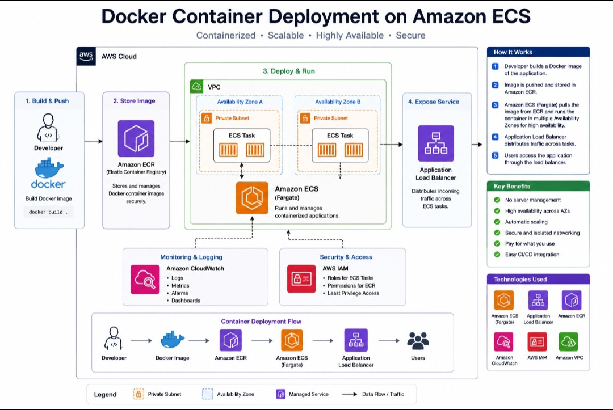

# Docker Container Deployment on Amazon ECS

## Project Summary

Designed a containerized application deployment architecture using Docker and Amazon Elastic Container Service (ECS). This project demonstrates how applications can be packaged into Docker containers and deployed using AWS container services.
## Architecture Diagram



## Architecture

The application is packaged as a Docker image. The image is stored in Amazon Elastic Container Registry (ECR) and deployed through Amazon ECS.

ECS manages the application containers, while AWS networking and security services control access to the application.

## AWS Services

- Amazon ECS
- Amazon ECR
- Amazon VPC
- Application Load Balancer
- Amazon CloudWatch
- AWS IAM
- Security Groups

## Technologies

- Docker
- Amazon ECS
- Amazon ECR
- Linux
- AWS CLI

## Architecture Flow

Application Code → Docker Image → Amazon ECR → Amazon ECS → Application Load Balancer → Users

## Key Features

- Docker containerization
- Container image storage with Amazon ECR
- Container orchestration with Amazon ECS
- Load-balanced application traffic
- IAM-based access control
- Security group protection
- CloudWatch logging and monitoring
- Scalable container architecture

## Skills Demonstrated

- Docker
- Amazon ECS
- Amazon ECR
- Containerization
- AWS networking
- IAM
- CloudWatch
- Load balancing
- AWS CLI
- Linux fundamentals

## What I Learned

This project strengthened my understanding of containers and cloud-based application deployment. I learned how Docker
## Container Deployment

### Build the Docker Image

```bash
docker build -t aws-ecs-portfolio .
```

### Run Locally

```bash
docker run -p 8080:8080 aws-ecs-portfolio
```

Open:

`http://localhost:8080`

Health check endpoint:

`http://localhost:8080/health`

### Amazon ECR & ECS

For an AWS deployment, the container image can be:

1. Built with Docker.
2. Tagged for an Amazon ECR repository.
3. Pushed to Amazon ECR.
4. Referenced by the ECS task definition.
5. Run as an Amazon ECS Fargate service.

## Project Files

- `app.py` — Flask web application
- `requirements.txt` — Python dependencies
- `Dockerfile` — Container image definition
- `.dockerignore` — Files excluded from the Docker build
- `ecs-task-definition.json` — Amazon ECS Fargate task definition
- `diagram4.jpg` — Architecture diagram

## Security Note

AWS credentials and other secrets should never be committed to this repository. Deployment credentials should be managed securely using IAM roles, GitHub Secrets, or AWS-supported identity federation.
