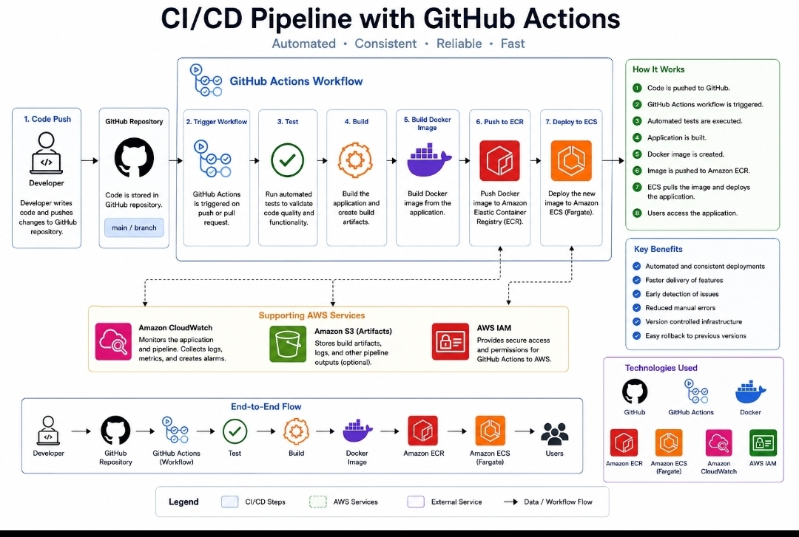

# CI/CD Pipeline with GitHub Actions

## Project Summary

Designed a Continuous Integration and Continuous Deployment (CI/CD) workflow using GitHub Actions. This project demonstrates how application changes can be automatically tested, built, and prepared for deployment whenever code is pushed to a GitHub repository.
## Architecture Diagram



## Architecture

A developer pushes code to GitHub, which automatically triggers a GitHub Actions workflow. The workflow performs automated build and testing steps before preparing the application for deployment.

## Technologies Used

- GitHub
- GitHub Actions
- CI/CD
- Docker
- AWS
- YAML
- Git

## Workflow

1. Developer makes changes to application code.
2. Code is pushed to the GitHub repository.
3. GitHub Actions automatically starts the workflow.
4. The application is built.
5. Automated checks and tests are performed.
6. Successful builds can proceed to deployment.

## Skills Demonstrated

- CI/CD concepts
- GitHub Actions workflows
- Source control with Git
- Automated build processes
- DevOps automation
- Docker integration
- AWS deployment concepts

## Security Considerations

Sensitive credentials should not be stored directly in source code. GitHub Secrets or secure AWS authentication methods should be used for credentials required by automated workflows.

## Project Status

Portfolio demonstration project documenting a CI/CD architecture and workflow.
## CI/CD Implementation

This project includes GitHub Actions workflow examples for Continuous Integration and Continuous Deployment.

### Continuous Integration

The `test.yml` workflow:

- Checks out the repository
- Configures Python 3.12
- Installs application dependencies
- Validates Python syntax
- Builds the Docker image to verify the container configuration

### Continuous Deployment

The `deploy.yml` workflow demonstrates:

- GitHub repository checkout
- Secure AWS authentication using GitHub OIDC
- Amazon ECR authentication
- Docker image build
- Docker image push to Amazon ECR
- ECS task definition update
- Deployment to Amazon ECS

## CI/CD Flow

```text
Developer
   ↓
GitHub Repository
   ↓
GitHub Actions
   ↓
Automated Tests
   ↓
Docker Build
   ↓
Amazon ECR
   ↓
Amazon ECS
```

## Security

AWS credentials should never be stored directly in the repository.

The deployment workflow is designed to use GitHub OIDC and an IAM role through the `AWS_ROLE_ARN` GitHub secret, avoiding long-lived AWS access keys.

## Workflow Files

- `.github/workflows/test.yml` — Continuous Integration workflow
- `.github/workflows/deploy.yml` — Continuous Deployment workflow
- `diagram5.jpg` — CI/CD architecture diagram

## Deployment Status

The workflow configuration is provided as a portfolio implementation. AWS resources and GitHub OIDC configuration must be created and configured before the deployment workflow can successfully deploy to Amazon ECS.
