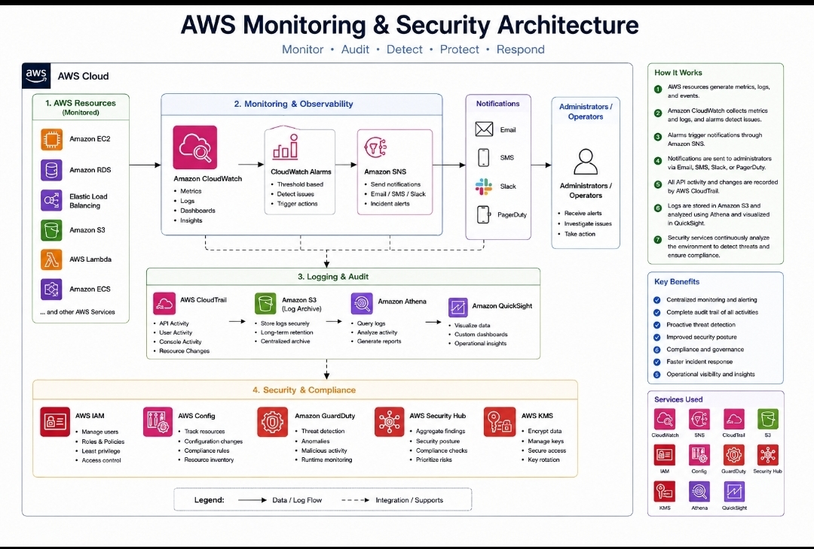

# AWS Monitoring & Security

## Project Summary

Designed an AWS monitoring and security architecture to demonstrate how cloud resources can be monitored, audited, and protected using AWS security and observability services.
## Architecture Diagram



## Architecture

Amazon CloudWatch monitors AWS resources and application performance. CloudTrail records AWS account activity and API actions for auditing. Amazon SNS can send notifications when CloudWatch alarms are triggered. IAM controls access to AWS resources using users, roles, and policies.

## AWS Services

- Amazon CloudWatch
- AWS CloudTrail
- Amazon SNS
- AWS IAM
- Amazon EC2
- Amazon VPC

## Monitoring Workflow

1. AWS resources generate metrics and logs.
2. CloudWatch collects monitoring information.
3. CloudWatch alarms detect configured conditions.
4. Amazon SNS can send alert notifications.
5. CloudTrail records account and API activity for auditing.

## Security Practices

- Apply least-privilege IAM permissions
- Use IAM roles instead of hard-coded credentials
- Enable logging and monitoring
- Monitor important account activity
- Restrict network access with security groups
- Protect sensitive information and credentials
- Review CloudTrail logs for auditing

## Skills Demonstrated

- AWS monitoring concepts
- CloudWatch metrics and alarms
- CloudTrail auditing
- SNS notifications
- IAM access control
- AWS security best practices
- Cloud infrastructure monitoring

## Project Status

Portfolio demonstration project documenting an AWS monitoring and security architecture.
## Monitoring & Security Implementation

This project includes Infrastructure as Code and IAM policy examples for AWS monitoring, auditing, alerting, and security.

### CloudTrail Auditing

The `monitoring.yaml` CloudFormation template demonstrates:

- AWS CloudTrail multi-region auditing
- Encrypted Amazon S3 storage for CloudTrail logs
- S3 public-access protection
- Log file validation
- Amazon SNS alert infrastructure

### CloudWatch Monitoring

The `cloudwatch-alarm.yaml` template demonstrates:

- EC2 CPU monitoring
- CloudWatch alarms
- Configurable alarm thresholds
- SNS alarm notifications
- Recovery notifications when metrics return to normal

### IAM Security

The `iam-monitoring-policy.json` file demonstrates a limited monitoring policy with permissions for:

- CloudWatch metrics and alarms
- CloudTrail event lookup
- CloudWatch Logs
- SNS topic visibility

The policy avoids broad administrator permissions and demonstrates the principle of least privilege.

## Monitoring Flow

```text
AWS Resources
     ↓
CloudWatch
     ↓
CloudWatch Alarm
     ↓
Amazon SNS
     ↓
Administrator Notification

AWS Account Activity
     ↓
AWS CloudTrail
     ↓
Encrypted Amazon S3 Logs
```

## Project Files

- `monitoring.yaml` — CloudTrail, S3 and SNS CloudFormation infrastructure
- `cloudwatch-alarm.yaml` — CloudWatch alarm configuration
- `iam-monitoring-policy.json` — IAM monitoring policy example
- `diagram6.jpg` — Monitoring and security architecture diagram

## Deployment Status

These files provide a portfolio implementation of the monitoring and security architecture. AWS resources must be deployed and tested before the project is described as a production deployment.
